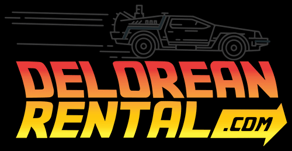

# DeLorean Rental

Implement the business logic of a Rent a car, create an ApiRestfull connected to MongoAtlas and implement the object composition. Introduction to linked objects by prototypes of JS. 
The basics of a project to understand JavaScript in it's low level, get a nice perspective of the scripting language and get familiarized with it. 

What else we cana ask for ? Give a chance and browse the code, you'll love it too. (JavaScript, the project can be done much better, I'm sure of it)

[](https://github.com/pau13-loop/DeLorean-Rental-OLOO-JS)
[](https://jestjs.io/)
[](https://jestjs.io/)
[](https://nodejs.org/en/)
[](https://www.npmjs.com/)
[](https://github.com/pau13-loop/DeLorean-Rental-OLOO-JS)


<!-- Source: https://www.deloreanrental.com/ -->
<p align="center">
  
</p>


## Table of Contents

1. [OLOO](#oloo)
1. [Motivation](#motivation)
1. [Technologies Implemented](#technologies-implemented)
1. [Required dependencies](#required-dependencies)
1. [Required dependencies](#required-dependencies)
1. [Bibliography](#bibliography)
1. [Installation](#)
1. [Collaboration References](#)
1. [License](#license)

## OLOO

What is it OLOO ?

First of all we have to understand what means "OLOO" to understand the concept. OLOO means, Objects Linking to Other Objects. And now we are ready to know how JavaScipts works in base low level. Everything in JavaScript is considered an object and every object has his own prototype.   

---

**[⬆ back to top](#table-of-contents)**

## Motivation

This project has been created thanks to the motivation of our coding head teacher to learn the paradigm of JavaScript as good and as close as possible. We had to create an api with Express and implement a connection to a no relationl data base, like MongoDB in this case. I've to say that it was a lot easier than I expected and thanks to projects like this kind if started to develop a big love for JavaScript language and the easy way that JS it turns out to be to give you freedom when you code. Sometimes this can be harm but if you implement SOLID Principles and follow a good developing strategy it should do more good than bad. Always keep in mind the "clean code conventions and project architecture", SOLID Principles, design patterns and good naming.

---

**[⬆ back to top](#table-of-contents)**

## Technologies Implemented

- JS
- Git
- Node.js
- NPM
- Express
- MongoDB

## Required dependencies

###### Production

- cookie-parser
- debug
- dotenv
- express
- http-errors
- jade
- mongoose
- morgan
- node 
- npm
- express-generator

###### Development

- cross-env
- eslint
- jest
- nodemon
- supertest

---

**[⬆ back to top](#table-of-contents)**

### Questions & Answers that came up during the project development

1. El modulo resource nos lo podemos ahorrar ??? Ya que en principio el la logica de Ollivaners habiamos creado uno ya que el controller actuaba como el router y el resource de Ollivanders actuaria como el controller de node. 
We can save the resource module ? Because in Ollivanders logic we have created one and the controller in my opinion would act as the router and the Ollivanders resource would act as the node controller. I'm I right ? (Ollivanders is a reference of a project from the first year of Software Development)

> Yes, we can save the logic from the resources layer because in Ollivanders project the routers layer was missing

2. If a list returns empty when I do a getAll, where do I check if I return the list or an error message in case it is empty, in the Service or in the controller layer ? I create a function that the only thing I do is to check if the list is empty and keep SRP ? 

> It is a validation that will be performed constantly for each method that returns a list, it would make sense to create a function. And some validation should be done, a method can be created for it and it should be created in the Controller of the application.

3.   Validations should be done in the service and the object should encapsulate simple logic that is only called if some condition is met?

> The business logic must be encapsulated in the domain. In the service we only attack the database and filter or sort it if desired, but the business logic, which is what I am proposing in this case, is encapsulated in the domain.

4. This function is redundant  ?
```
        getMinPrice: function() {
        return this.getOriginalPrice * 0.3;
    },

    if (this.price > this.originalPrice * 0.3)
```

> If I had placed the method inside the conditional, the domain language would be much more intuitive and would make it easier to maintain the code in case future programmers come to work on the project. As quick as you read the method name you'll related with it's purpose.

5. When to assign the prototype to objects ? 

> The assignment or linking of prototypes must take place in the domain, in the domain logic. Each entity shall be responsible for linking its prototype to the objects.

6. When I order the objects ?

> In the call to the DB I can now make it give me the objects ordered according to my interests.


# Historias de usuario

- Los obj tendrán el precio inicial de cuando se obtuvieron por primera vez de BD. Por esta razón una vez acabe el "Black Friday" podrán restablecer su valor original sin hacer una query costosa, tan solo tendrán que acceder a su atributo "originalPRice" que será [no enumerable, no configurable y no writeable]. El atributo no vendrá definido de BD por lo que nos ahorramos el campo en los obj a la hora de meterlos en BD y lo creamos al inicializar el obj

- El precio mínimo nunca podrá ser inferior al 40% del precio original o en ese caso al precio se lelos obj a la hora de meterlos en BD y lo creamos al inicializar el obj

- El precio mínimo nunca podrá ser inferior al 40% del precio original o en ese caso al precio se le asignará el valor devuelto por la función getMinPrice(). Cuando hay oferta de descuent asignará el valor devuelto por la función getMinPrice(). Cuando hay oferta de descuento como el Black Friday, no se le aplicará está lógica, cualquier descuento sobre el precio está permitido, la ocasión lo merece, rebajas sin control, no ? Política Black Friday consumista !

- Cada vez que un vehiculo cumple un año se le actualizará el 10% del precio original

- Los vehiculos que tienen un descuento son todos, pero los clasicos no actualizarán su precio (solo lo descuentan en BF), su precio mantiene a lo largo del programa.

- Los vehiculos clasicos no se eliminaran nunca de la flota, solo se eliminaran coches con una antiguedad superior a cinco años y categoria no clasica

- Solo se pueden añadir vehiculos a la flota con una antiguedad inferior a cinco años

- Debería comprobar que al actualizar los coches su disponibilidad está seteada a "true". Solo actualizan los vehiculos con disponibilidad seteada a "true"

- Closure para conseguir asistencia técnica ??? Cuando un vehiculo es reservado se define una propiedad del objeto que trata sobre conseguir asistencia técnica. Solo se puede acceder a ella mientras su prop available este seteada a false. Basicamente lo que hace es pasarle un nombre por parametro y devolver un mensaje diciendo: "Asistencia técninca en camino para <nombre>"

## User Stories

[***User Stories***](./doc/user-stories.md)

---

## Bibliography

[**Bibliography**](./doc/bibliography.md)

---

## Mongo Refresh

[***Mongo Refresh***](./doc/mongo-refresh.md)

---

## Node Refresh

[***Node Refresh***](./doc/node-refresh.md)

---

**[⬆ back to top](#table-of-contents)**

## License

MIT License

Copyright (c) 2020 AntoniPizarro and Pau Llinàs

Permission is hereby granted, free of charge, to any person obtaining a copy
of this software and associated documentation files (the "Software"), to deal
in the Software without restriction, including without limitation the rights
to use, copy, modify, merge, publish, distribute, sublicense, and/or sell
copies of the Software, and to permit persons to whom the Software is
furnished to do so, subject to the following conditions:

The above copyright notice and this permission notice shall be included in all
copies or substantial portions of the Software.

THE SOFTWARE IS PROVIDED "AS IS", WITHOUT WARRANTY OF ANY KIND, EXPRESS OR
IMPLIED, INCLUDING BUT NOT LIMITED TO THE WARRANTIES OF MERCHANTABILITY,
FITNESS FOR A PARTICULAR PURPOSE AND NONINFRINGEMENT. IN NO EVENT SHALL THE
AUTHORS OR COPYRIGHT HOLDERS BE LIABLE FOR ANY CLAIM, DAMAGES OR OTHER
LIABILITY, WHETHER IN AN ACTION OF CONTRACT, TORT OR OTHERWISE, ARISING FROM,
OUT OF OR IN CONNECTION WITH THE SOFTWARE OR THE USE OR OTHER DEALINGS IN THE
SOFTWARE.

---

**[⬆ back to top](#table-of-contents)**
